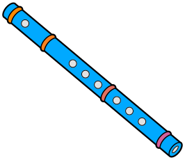

#  Kaval


[](https://ktlint.github.io/)
[](https://github.com/KotlinBy/awesome-kotlin)

This is a Kotlin multiplatform library to validate your model.

## Why

The goal is to find the right balance between conciseness, expressiveness, and composability to validate POJO.

Or you can see it as a validation DSL.

## Example

We want to validate this model

```kotlin
data class User(
    val firstName: String,
    val lastName: String,
    val address: Address?
)

data class Address(
    val line1: String,
    val line2: String,
    val zipCode: Int,
    val city: String
)
```

We can validate the `Address` with these constraints:

- line1: not blank, and length <= 255
- line2: length <= 255
- zipCode: > 0
- city: not blank

```kotlin
val addressValidator: Validator<Address> =
    property<Address, String>(Address::line1) {
      notBlank and maxLength(255)
    } and property(Address::line2) {
      maxLength(255)
    } and property(Address::zipCode) {
      greaterThan(0)
    } and property(Address::city) {
      notBlank
    }
```

And the `User` with these constraints:

- firstName: not blank, and length <= 128
- lastName: length <= 255
- address: see above

```kotlin
val userValidator: Validator<User> =
    property<User, String>(User::firstName) {
        notBlank and maxLength(128)
    } and property(User::lastName) {
        notBlank and maxLength(255)
    } and property(User::address) {
        nullOr { addressValidator }
    }
```

Now we can use the validators:

```kotlin
val user = User(
   firstName = "",
   lastName = "x".repeat(500),
   address = Address(
       line1 = "",
       line2 = "",
       zipCode = -1,
       city = ""
   )
)

val result: ValidationResult<User> = userValidator.validate(user)
println(result)
// Invalid:
//  - [firstName] require to be not blank
//  - [lastName.length] require to be lower or equals to 255, got 500
//  - [address.line1] require to be not blank
//  - [address.zipCode] require to be greater than 0, got -1
//  - [address.city] require to be not blank should be Valid
```

## Modules

* [kaval-core](./kaval-core): the core, start here
* [kaval-reflect](./kaval-reflect): add a validator using Kotlin reflection
* [kaval-kotest](./kaval-kotest): add custom matchers for [kotest](https://github.com/kotest/kotest)
* [some samples](./samples/src/main/kotlin)
